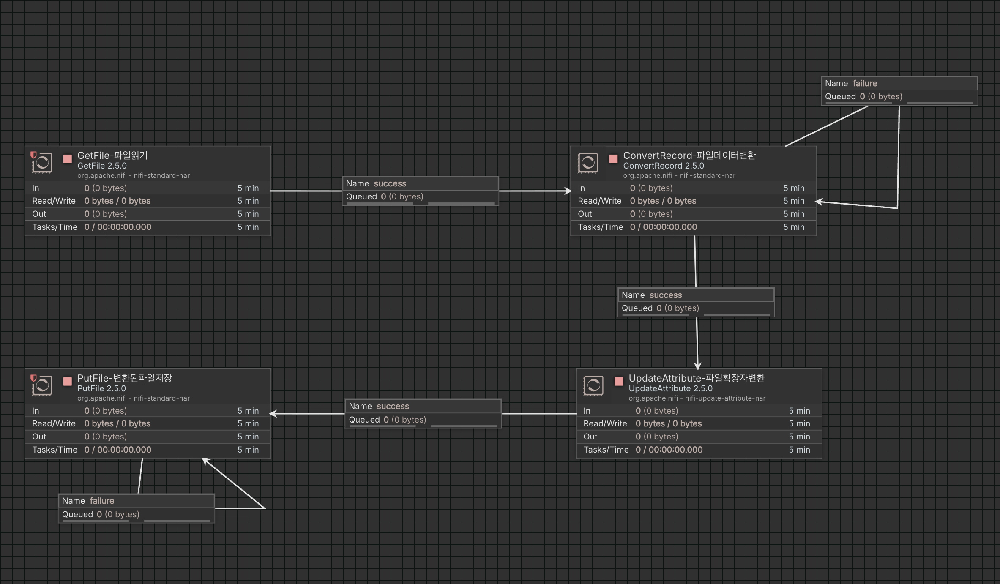

# 예제 1: CSV 파일 처리 플로우



## 샘플 데이터 디렉토리 생성

```bash
mkdir -p ~/nifi-data/input
mkdir -p ~/nifi-data/output
```

## 볼륨 마운트와 함께 NiFi 실행

```bash
docker run --name nifi-lab \
  -p 8443:8443 \
  -e SINGLE_USER_CREDENTIALS_USERNAME=admin \
  -e SINGLE_USER_CREDENTIALS_PASSWORD=adminPassword123! \
  -v ~/nifi-data:/opt/nifi-data \
  -d \
  apache/nifi:latest
```

## 테스트 순서

### 1. Process Group 생성

### 2. Group 내에 다음 Process 들을 생성

#### GetFile

1. 프로세서 추가

- Processor 아이콘을 Canvas 안으로 드래그
- Add Processor 에서 GetFile 검색
- GetFile Processor 를 추가

2. 프로세서 설정

- Input Directory: /opt/nifi-data/input # 읽을 파일들이 있는 경로
- File Filter: .\*\.csv # CSV 파일만 선택
- Keep Source File: false # 처리 후 원본 파일 삭제
- Minimum File Age: 0 sec # 즉시 처리
- Polling Interval: 10 sec # 10초마다 확인

#### ConvertRecord

1. Controller Services 에 CSVReader 생성

- Canvas 에서 마우스 우클릭 - Controller Services 에서 추가
- CSVReader 검색 - 선택
- 추가된 CSVReader 설정
  - CSV Format: RFC4180
  - Value Separator: ,
  - Treat First Line as Header: true
  - Schema Access Strategy: Use String Fields From Header
- Enable 활성화

2. Controller Services 에 JsonRecordSetWriter 생성

- Canvas 에서 마우스 우클릭 - Controller Services 에서 추가
- JsonRecordSetWriter 검색 - 선택
- 추가된 JsonRecordSetWriter 설정
  - Schema Write Strategy: Do Not Write Schema
  - Schema Access Strategy: Use 'Schema Name' Property
  - Pretty Print JSON: true
- Enable 활성화

3. 프로세서 생성

- Processor 아이콘을 Canvas 안으로 드래그
- Add Processor 에서 ConvertRecord 검색
- ConvertRecord Processor 를 추가

4. 프로세서 설정

- Record Reader: CSVReader (방금 생성한 서비스)
- Record Writer: JsonRecordSetWriter (방금 생성한 서비스)
- Include Zero Record FlowFiles: false

#### UpdateAttribute

1. 프로세서 추가

- Processor 아이콘을 Canvas 안으로 드래그
- Add Processor 에서 UpdateAttribute 검색
- UpdateAttribute Processor 를 추가

2. 프로세서 설정

- Properties 탭에서 property 들을 추가
  - Property Name: filename
  - Property Value: ${filename:substringBeforeLast('.')}.json

#### PutFile

1. 프로세서 추가

- Processor 아이콘을 Canvas 안으로 드래그
- Add Processor 에서 PutFile 검색
- PutFile Processor 를 추가

2. 프로세서 설정

- Directory: /opt/nifi-data/output # 프로세서 처리 후 파일을 저장할 경로
- Conflict Resolution Strategy: replace # 같은 파일명 있으면 교체
- Create Missing Directories: true # 폴더 없으면 생성

### 3. 생성한 프로세스들을 순서대로 연결

#### 연결 순서

- GetFile -> ConvertRecord -> UpdateAttribute -> PutFile
- 연결시 RelationShips 를 success 체크
  - 성공시 다음 단계 진행
- 연결된 다음 프로세스가 없는 PutFile 의 RelationShips 의 failure/success 설정
  - 연결된 다음 프로세스가 있는 다른 프로세스들은 설정하지 않는다.

#### 각 단계에서의 처리

- GetFile : 지정된 경로에서 처리할 csv 파일을 읽어옴
- ConvertRecord : GetFile 에서 읽은 csv 파일 데이터를 json 으로 변경
- UpdateAttribute : GetFile 에서 읽은 csv 파일의 확장자를 json 으로 변경
- PutFile : 앞에서 처리된 파일을 지정된 경로에 저장

### 4. 테스트 실행

1. 모든 프로세스들을 Start 상태로 변경
2. 테스트 파일 생성

- ```bash
  echo "name,age,city
  John,30,New York
  Jane,25,Los Angeles
  Bob,35,Chicago" > ~/nifi-data/input/sample.csv
  ```

3. 볼륨 마운트한 실제 경로에서 생성한 파일이 처리되는지 확인
